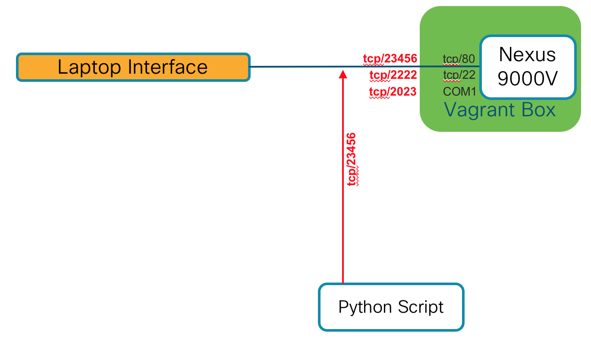

# Objective 
Simple Python script to query the NXAPI

# Outcomes
- Demonstrate use of the requests module
- Examples of navigating returned data structure

# Pre-requisites
- [Vagrant Box Instructions](../../n9kv/README.md)
  - Must have Nexus 9000v Vagrant box running
  - Must have iCAM enabled via *setup_nxos.py* script

# Network Communication Diagram

# How to use
    python generate_l2table.py

